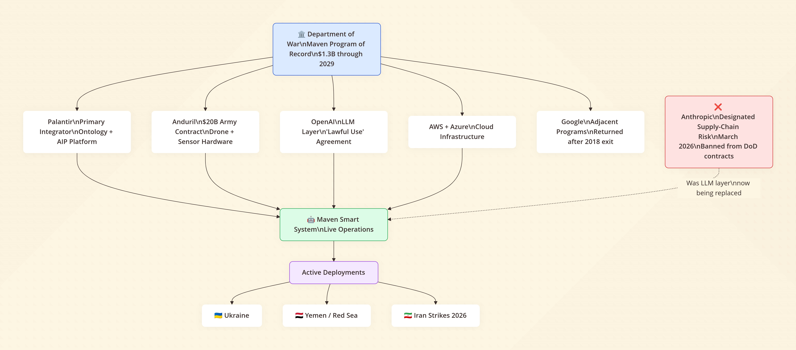
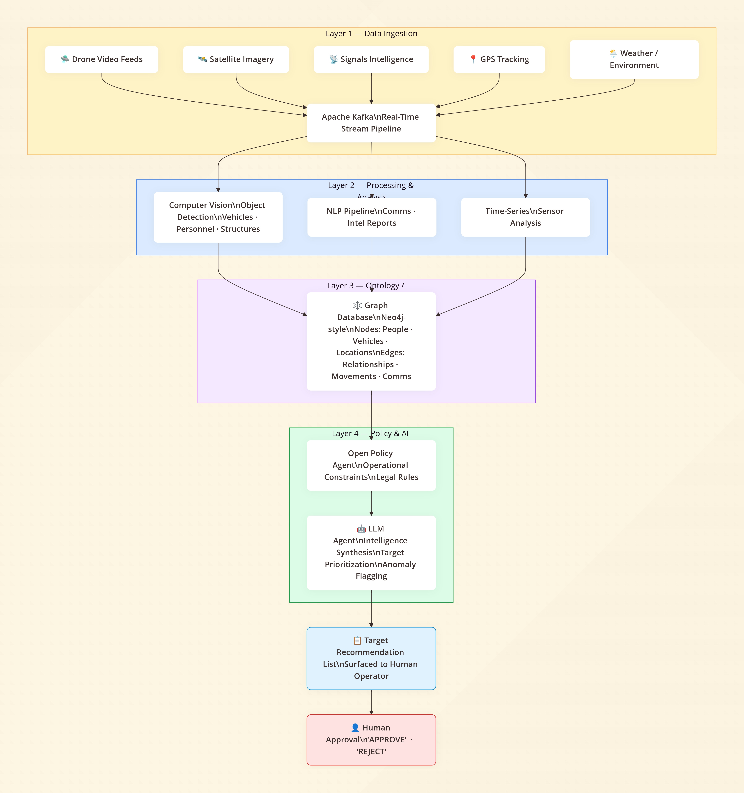
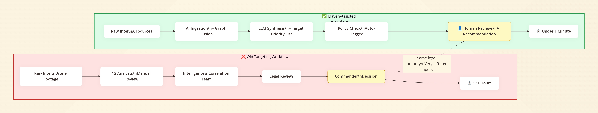
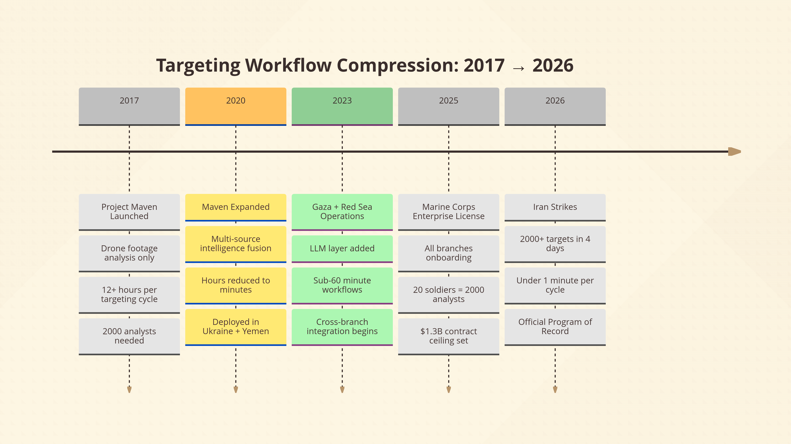

In the first four days of U.S. and Israeli strikes on Iran in late February 2026, more than 2,000 targets were hit. Many of those targets came off a list generated by an AI platform built by a data analytics company out of Denver. No human analyst pieced those targets together from scratch. The machine did the work, and a person clicked approve.

That platform is the Maven Smart System. And as of March 23, 2026, it's no longer just a Pentagon experiment — the Department of War has formally designated it an **official Program of Record**, meaning stable long-term funding, mandatory adoption across all branches, and a contract ceiling that's been bumped to **$1.3 billion through 2029**.

Welcome to America's first AI war. The tech bros won the contract. Now they run the battlefield.

---

## What Is the Maven Smart System?

**Maven Smart System (MSS) is an AI-powered command-and-control platform built primarily by Palantir that ingests battlefield data from drones, satellites, sensors, and intelligence reports in real time. It uses computer vision, sensor fusion, and large language models to identify, track, and prioritize targets — compressing targeting workflows that once took 12 hours into under a minute, and achieving with 20 soldiers what used to require 2,000.**

It's not a weapon. It's the operating system that tells the weapons where to go.

---

## This Just Got Official

On March 9, 2026, Deputy Secretary of War Steve Feinberg issued a letter directing Pentagon leaders to formalize Maven as a Program of Record — a designation that unlocks sustained budgeting and forces the entire military establishment to get onboard. The Army, Navy, Marine Corps (which acquired an enterprise license back in August 2025), Air Force, and Space Force are all folding MSS into their standard operating infrastructure.

The Army's Combined Arms Command is already integrating Maven into its formal curriculum at the Command and General Staff College. Field grade officers will graduate knowing how to operate it. Maven isn't a pilot program anymore — it's part of how the U.S. military is trained to think.

As Mike Clowser, the Army's lead for Maven's training plan, put it: *"Maven's use is being fielded so fast, we need to deliver training as quickly as possible."*

That quote deserves a second read. They're deploying faster than they can train people to use it.

---

## Where This Started: Google Quit, Palantir Stepped In

Maven didn't arrive overnight. In 2017, Deputy Defense Secretary Robert Work launched **Project Maven** — formally the Algorithmic Warfare Cross-Functional Team — with a narrow mandate: use computer vision to automatically analyze drone footage. The Pentagon was drowning in video it couldn't watch.

Google was the first major tech partner. By 2018, thousands of Google engineers had signed a letter protesting involvement in "warfare technology," and Google didn't renew its contract. Their departure directly created the multi-vendor architecture that exists today.

Palantir — co-founded by Peter Thiel and now run by Alex Karp — stepped into the vacuum and never left. Since then, Maven has grown from a drone footage analyzer into a comprehensive intelligence fusion platform spanning Ukraine, Gaza, Yemen, the Red Sea, and now Iran.

The Silicon Valley culture around this stuff has also shifted dramatically. Where Google engineers protested, a new generation of founders is *racing* toward defense contracts. One of them told Reuters in October 2025: "I'm a warlord now, bitch." He runs a company that makes AI-powered autonomous machine guns. He has $40 million in funding, a podcast, and prototype contracts with the U.S. Army.

That's the vibe shift you need to understand to follow what's happening.

---

## How Maven Actually Works Under the Hood

The exact tech stack is classified. But between public filings, leaked architecture details, and the companies involved, we can piece together how a system like this operates. Here's where it gets genuinely interesting.

**Layer 1: Data Ingestion**

Maven starts by consuming enormous streams of heterogeneous data — live drone video feeds, signals intelligence, satellite imagery, GPS tracking, comms intercepts, weather overlays. All of it arriving simultaneously, in different formats, at different update rates.

To handle this at scale and in real time, you need something like **Apache Kafka** — a distributed event streaming platform that lets you wire multiple data sources into a single flowing pipeline. Think of it as the plumbing that keeps the whole system's nervous system synchronized.

**Layer 2: Processing and Analysis**

Once you have the raw stream, you need to make sense of it. Video frames from drones get routed to computer vision pipelines — tools like **OpenCV** or more sophisticated proprietary models — that segment footage and detect objects: vehicles, weapons systems, personnel, structures. This is where the original Project Maven mandate lives, except now it's just one piece of a much larger system.

Structured intelligence reports and comms get routed to natural language pipelines. Time-series sensor data gets processed separately. Each source feeds into a common representation layer.

**Layer 3: The Ontology (Palantir's Secret Sauce)**

Here's where things get philosophically interesting — and where Palantir earns its billions.

Raw data doesn't know it's related to anything. A drone spotting a truck doesn't know that truck belongs to the same cell that a phone intercept mentioned yesterday, which is three kilometers from a building flagged in satellite imagery last week. Connecting those dots is the hard problem.

Palantir's core technology is what they call an **ontology** — essentially a structured map of the entire operational environment. People, vehicles, locations, events, relationships, and metadata all get normalized into a shared schema. The ontology is a digital twin of the battlefield.

To represent the relationships between all those entities, you don't use a traditional relational database — you use a **graph database** (think Neo4j). Nodes are entities: a person, a vehicle, a building, a weapons cache. Edges are relationships: *this person was here, this truck moved between these two points, these two phones communicated*. The whole battlefield becomes a queryable, visualizable network.

This is the layer commanders interact with. It's also the layer AI agents query.

**Layer 4: Policy and Agents**

Before any automated action can occur, you need rules. Tools like **Open Policy Agent** can enforce operational constraints across the entire stack — defining what kinds of queries are allowed, which targets meet defined criteria, what requires human escalation.

On top of that, you can drop in AI agents — large language models given structured access to the ontology via the **Model Context Protocol (MCP)**. The LLM doesn't just answer questions; it can run complex multi-step reasoning across live battlefield data, synthesize intelligence from multiple sources, draft targeting recommendations, and flag anomalies.

Palantir's own AIP platform is the commercial equivalent of this architecture. The military version runs on a classified network. Until very recently, the LLM powering this layer was Anthropic's Claude.

---

## "There's Still a Human in the Loop" — Let's Be Honest About What That Means

You'll hear this a lot. It's technically true. A human does have to authorize a strike. No missile launches autonomously.

But here's the thing worth sitting with: when the system has already ingested terabytes of surveillance data, fused it through a graph of relationships, run it through an LLM that's synthesized cross-source intelligence, and surfaced a prioritized target list — what is the human actually approving?

They're approving the output of a process they can't fully audit, running on data they can't fully verify, at a speed no human could have independently replicated. The "human in the loop" isn't evaluating the intelligence from scratch. They're reviewing a recommendation.

Most people don't realize that the bottleneck in modern warfare isn't firepower. It's the speed at which you can legally confirm a target and authorize a strike. That's what "shortening the kill chain" means. And AI shortens it by compressing the cognitive and analytical work that used to take dozens of specialists into a workflow one person can approve in seconds.

That's genuinely useful for minimizing mistakes — the whole system exists partly because unverified targeting in older operations led to catastrophic civilian casualties. But it also means the quality of the AI's judgments now has life-and-death consequences at a scale and speed that no oversight structure has fully caught up with.

---

## The Anthropic Ban: What It Actually Reveals

.png)

In March 2026, Secretary of War Pete Hegseth formally designated Anthropic a **supply-chain risk** — a label previously reserved for foreign adversary companies like Huawei. All federal agencies were ordered to phase out Claude within six months. Defense contractors were told to cut commercial ties with Anthropic entirely.

Why? Because Anthropic refused to remove two contractual limits:

1. Claude could not be used for **fully autonomous weapons** — systems that kill without a human decision
2. Claude could not be used for **mass domestic surveillance of Americans**

From Anthropic's public statement: *"We do not believe that today's frontier AI models are reliable enough to be used in fully autonomous weapons. Allowing current models to be used in this way would endanger America's warfighters and civilians."*

The Pentagon's position was straightforward: once they pay for a technology, they should be able to use it for any lawful purpose. They can't have vendors setting operational constraints on government missions.

The political framing — Hegseth calling Anthropic's limits "woke AI" — is a distraction from what the fight is actually about. This isn't really a culture war. It's a negotiation over **who sets the rules of AI use in warfare**, and whether private companies can maintain ethical red lines when governments want to go further.

And here's the operationally uncomfortable part: Claude was confirmed to still be running inside Maven during the Iran strikes, even after the ban was announced. The military's own IT staff were furious about the ban. According to Reuters, one IT contractor said the career people at DoD "hate this move because they had finally gotten operators comfortable using AI. They think it's stupid." Another said swapping out Claude for alternatives like xAI's Grok — which reportedly gave "inconsistent answers to the same query" — could take 12 to 18 months to recertify.

The Pentagon punished the only AI company that held the line on two guardrails. Every other major lab — OpenAI, Google, xAI — agreed to "lawful use" terms without the same restrictions. OpenAI's Sam Altman stepped into the gap almost immediately. The message to the industry is clear.

---

## The Numbers That Put This in Context

The efficiency gains are staggering and can't be dismissed:

* **12 hours → under a minute** for targeting data processing (2020 to present, per MDAA)
* **20 soldiers doing the work of 2,000** in targeting exercises
* **2,000+ Iranian targets struck in 4 days**, many from Maven-generated lists
* Palantir's stock climbed **12%+ since the Iran war began**
* The Army awarded Anduril — which supplies drone hardware that feeds Maven — a **$20 billion deal** in March 2026
* Andreessen Horowitz closed a **$1.2 billion defense tech fund** in January 2026 alone

The venture capital and the military doctrine are now pointing in the same direction. Silicon Valley spent years being conflicted about this. That conflict is effectively over.

---

## What This Means for Everyone Watching

The Anthropic standoff isn't a story about one AI company. It's the first major public test of a question that will define the next decade: **Can a private company refuse to let its AI be used to kill without human oversight, and survive the consequences?**

The answer, right now, is: barely, and maybe not.

What's being built in the Maven ecosystem is genuinely impressive engineering. The compression of battlefield intelligence from days of analyst work into seconds of machine synthesis is real, it works, and in some scenarios it probably does reduce civilian casualties compared to older, slower, less precise targeting methods.

But the direction of travel — less human judgment, faster loops, fewer ethical constraints on the AI provider side — is one that the rest of the world is watching very carefully. UN experts gathered in Geneva in March 2026 for Convention on Certain Conventional Weapons talks on autonomous weapons systems. The legal frameworks haven't caught up with what's already deployed.

As retired Air Force Lt. General Jack Shanahan, who led Pentagon AI integration during the Biden years, told the Sydney Morning Herald: *"I wouldn't be surprised if this is called America's first AI war."*

He's right. What nobody is saying loudly enough is that the second one will be faster.

---

## FAQ

**What is the Maven Smart System?**
Maven Smart System is an AI-powered platform built primarily by Palantir that fuses battlefield data from drones, satellites, and sensors into a real-time operational picture. It uses computer vision, a graph-based data ontology, and large language models to identify and prioritize targets. As of March 2026, it is the official battle management platform across all U.S. military branches.

**Did the US military use AI to make targeting decisions in the Iran conflict?**
Yes. According to multiple news reports including the New York Times and Reuters (March 2026), Maven Smart System was confirmed active during U.S.-Israeli strikes on Iran beginning February 28, 2026. Airstrikes hit over 2,000 targets in the first four days, with many targets selected from Maven-generated lists. This was the first publicly confirmed deployment of a commercial LLM in a major interstate conflict.

**Why did the Pentagon ban Anthropic?**
Defense Secretary Pete Hegseth designated Anthropic a "supply-chain risk" on March 3, 2026, after Anthropic refused to remove two contractual limits: prohibiting use of Claude for fully autonomous weapons (that fire without human input) and for mass domestic surveillance of Americans. Anthropic has disputed the designation's legal authority and announced plans to challenge it in court.

**Is there still a human in the loop in AI-assisted targeting?**
Technically, yes — a human must authorize lethal action. In practice, that human is reviewing AI-synthesized recommendations generated from data they didn't independently analyze, at speeds no human could match unaided. The "human in the loop" is real but doesn't mean the same thing it did before AI-assisted targeting existed.

**What companies power Maven Smart System?**
Palantir is the primary integrator, providing the data platform and ontology layer. AWS and Azure supply cloud infrastructure. Anduril provides drone and sensor hardware. Anthropic's Claude was the LLM layer until the March 2026 ban; OpenAI is now positioned to replace it. Google and Microsoft are also involved in adjacent defense AI programs.

**What is Palantir's "ontology" and why does it matter?**
Palantir's ontology is a structured data model that maps real-world entities — people, vehicles, locations, events — and their relationships into a unified, queryable format. It's the layer that lets AI and human analysts connect intelligence from disparate sources into a coherent operational picture. It's the main reason the Pentagon continues to pay Palantir billions: building and maintaining that shared intelligence layer is genuinely hard.

---

The architecture is solid, the contracts are locked in, and the political will is clearly there. The only open question now is whether the humans approving these outputs will have enough context — and enough time — to actually be making the decisions, or just ratifying them. That question doesn't have a clean answer yet. But it's the one that matters most.
